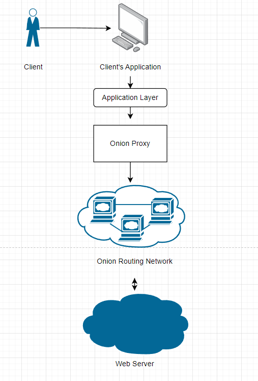
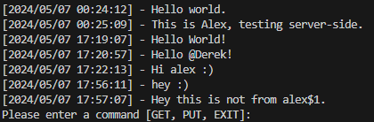
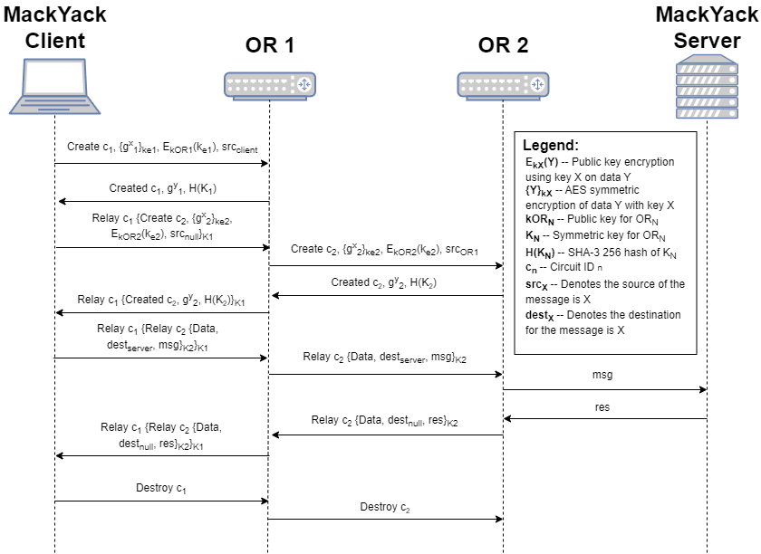
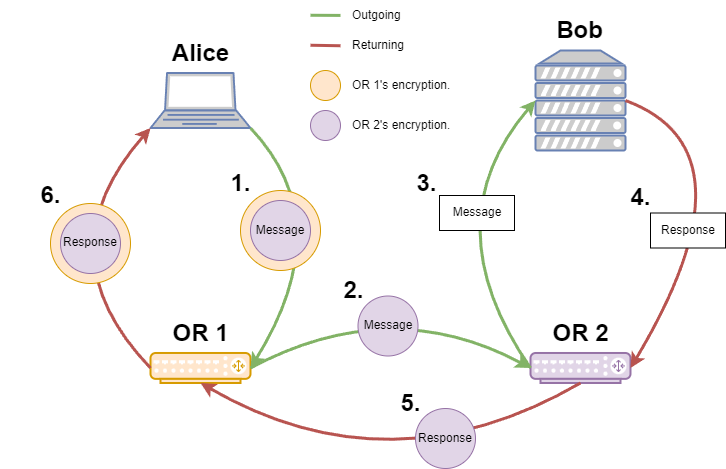

## MackYack Protocol

## Application Layer
---
MackYack is designed to be an anonymous messaging board system. We have created a Client Server model for handling operations on the board.
Client is allowed to receive messages on the board and update new messages on the board. While, the server is allowed to respond with the current state of the board and update the board when a new message is received.

### Client Functionality
- Message is sent to the server, where it is added to the MackYack board.
- Requests to the server are made periodically (every 3 seconds) to update the client's local view of the MackYack board.
- Anonymity is maintained by sending requests through an Onion Routing overlay network
    - Onion Routing overlay network is accessed via. an Onion Proxy. More details in "Onion Routing Protocol" section.

<p style="align: center;">

  

</p>

There exists three commands in our Client-side application.
 - `GET` - Constructs and sends a GetRequest
 - `PUT` - Prompts the interface for a message, and sends to server
 - `EXIT` - Closes the application and destroys the circuit.

<p style="align: center;">

  

</p>

#### Application Layer Messages
There exists four types of Application layer messages that can be sent
1. PutRequest
```
Client -> Server
Sent from Client through the circuit to the Server containing a message. This message will be appended to the board.

Properties:
    - String - data
```

2. Put Response
```
Server -> Client
Response sent to client to assure that their message has been added to the board.

Properties: (none)
```

3. Get Request
```
Client -> Server
Sent from the Client through the circuit to the Server asking to receive information regarding the board at the current instant.

Properties: (none)
```

4. Get Response
```
Server -> Client
Sent from the Server through the circuit to the Client responding with all of the Messages on the Board.

Properties:
    - List<Message> - messages
```

5. Message
```
Contained within Get Response object.
Sent as a series of Messages through the Get Response object to show which messages were present on the board at the time of the request.

Properties:
    - String - data
    - String - timestamp
```


## OnionProxy
---
The `OnionProxy` (OP) class serves as a Proxy within an Onion Routing Network, facilitating communication between a client and an Entrance Onion Router. It manages the establishment of secure communication channels between nodes, message relay, and message reception. The Onion Proxy is abstracted out from the client such that it can be ran as a unique layer between any Application layer that utilizes MerrimackUtil JSON Messaging and connects to our devised Onion Network.
The Onion Proxy (OP) is utilized by MackYack clients for accessing the Onion Routing overlay network, running on the client's local computer upon the MackYack application's launch.
 - It constructs the circuit, selecting from the client's list of known routers (located in routers.json), and has the ability to deconstruct the circuit by sending a destroy cell and its associated circID to the entry Onion Router (OR).
 - The OP encrypts MackYack messages to send to the entrance onion router in "layers," akin to an onion, encrypting the message with the key established with each OR in the circuit from the farthest node to the closest.
 - Subsequently, whenever a message is received from the entrance onion router, it decrypts MackYack responses by peeling back "layers," decrypting the message with the key established with each OR in the circuit from the closest node to the farthest.
 - Additionally, the OP handles various tasks such as:
   - Determining whether a received JSON object should be processed at the Proxy Layer or the ApplicationService Layer.
   - Finding the router associated with a specified circuit ID.
   - Managing relay cells received from an Onion Router.
   - Constructing messages to be sent.
   - Sending create cells to each router in the circuit.
   - Generating create cells for each router.
   - Building the circuit from the provided router configuration.

In the Tor implementation of Onion Routing there exists a `Authority` whose responsibility it is to distribute Onion Routers' information. Though, we did not choose to implement such an idea. Rather, the Onion Proxy has access to all of the Onion Routers in the overlay network. Then, the Onion Proxy choose k Onion Routers to initiate the circuit. 

#### Public API
### `public OnionProxy(RoutersConfig routersConfig, ClientConfig conf) throws Exception`
This constructor initializes the Onion Routing System. It requires configurations for routers and clients. Upon instantiation, it constructs the circuit, generates create cells for each OR, sends create cells to initiate circuit keys, and starts polling for new messages on the proxy.

### `public void send(String message) `
This method sends a string message to the entrance Onion Router. It establishes a socket connection and transmits the message.

### `public void pollProxy()`
Initiates the polling mechanism for new messages on the proxy.

### `public void destroy()`
Removes the circuit from the proxy and sends a DestroyCell to remove any reference of the circuit in the Onion Routing network.

### `public Router getEntryRouter()`
Reference to the first router of the circuit.

### `public List<Router> getCircuit()`
Returns the list of Router nodes that exist in the circuit.

## Onion Routing Protocol
---

<p style="align: center;">

  

</p>

### Onion Routing Service
 
The OnionRouterService class serves as a handler for messages directed to an onion router, onion proxy, or web server; managing various tables and cryptographic operations. It operates within a threaded service model, handling incoming messages via the run() method. Upon receiving different types of cells, such as Relay, Create, Created, and Destroy, it executes corresponding actions like relaying messages, creating connections, updating & computing creation keys, or managing destructions. It employs cryptographic functions for encryption and decryption, including AES encryption for message security. Additionally, it facilitates communication with other nodes in the network by sending messages to specified destinations or servers. Overall, OnionRouterService provides essential functionalities for the operation of an onion router within a network architecture.

#### Symmetric Key Creation Handling
The `OnionRouterService` class facilitates symmetric key creation as part of the handling of Create cells. Here's a high-level overview of the process:

1. **Receiving Create Cell**: 
   - Upon receiving a Create cell, the `doCreate()` method is invoked.
   - This method extracts the exchanged Diffie-Hellman parameters (gX) from the Create cell.

2. **Shared Secret Generation**:
   - The received gX parameter is used along with the OR's private key to perform a Diffie-Hellman key exchange.
   - This generates a shared secret between the OR and the originating client.

3. **Key Derivation**:
   - The shared secret is then used to derive a symmetric key (K) for encrypting subsequent communication between the OR and the client.

4. **Hashing and Storage**:
   - The derived symmetric key is hashed along with a predefined string ("handshake") using SHA3-256 hashing algorithm.
   - The resulting hash (K') is stored alongside the circuit ID in the OR's key table for future use in encrypting and decrypting messages.

5. **Response Generation**:
   - A Created cell containing the OR's public Diffie-Hellman parameter (gY) and the hash of the symmetric key (K') is constructed and sent back to the client.

6. **Encryption and Transmission**:
   - The Created cell is encrypted and transmitted back to the client, allowing the client to verify the key agreement and proceed with secure communication.

This process ensures secure symmetric key establishment between the OR and the client, enabling subsequent encrypted communication within the Onion Routing network.

#### Relay Handling

The `OnionRouterService` class manages Relay messaging, which involves relaying encrypted messages between nodes in the Onion Routing network. Here's an outline of the process:

1. **Receiving Relay Cell**: 
   - Upon receiving a Relay cell, the `doRelay()` method is invoked.
   - This method examines whether the Relay cell is incoming from the previous node or outgoing to the next node in the circuit.

2. **Incoming Relay Cell**:
   - If the Relay cell is incoming from the previous node, the method decrypts the Relay secret contained within the cell.
   - It then updates the initialization vector (IV) table with the IV received, decrypts the Relay secret to obtain the destination IP/port and child cell, and forwards the child cell to its destination.

3. **Outgoing Relay Cell**:
   - If the Relay cell is outgoing to the next node, the method packages the cell into a new Relay cell and forwards it to the next node.
   - It retrieves the address and port of the previous node from the "inTable" and sends the encapsulated Relay cell to this address/port.

4. **Data Relay**:
   - In the case of a Data cell within the Relay, the method either forwards it to the destination server or sends it to the next OR in the circuit based on the cell type.

5. **Error Handling**:
   - If the Relay cell's type is unknown or malformed, appropriate error messages are logged, and the connection is closed.

This process ensures the secure relay of messages within the Onion Routing network, allowing for anonymous and secure communication between nodes.

<p style="align: center;">

  

</p>

#### Data Handling
`Onion Peeling Messages (Request)`
 - When a message is being sent from the `Client` → `Server` it can be defined as a Onion Peeling Message in our application. This is because the onion is being peeled. The last message in the onion should be a Data message. 
 - Data Messages are destined for some server outside of the onion network (OR). 
 - To handle, the message is directed to the server outside of the OR.
 - Unfortunately, as Onion Routing paper left what we consider to be a security flaw in place. The exit onion router is able to see the plain-text information of what is contained inside a `DATA` message. This is not something we address in our service. Though we have have planned to encrypt the data child (plain-text to be sent to server) as a data secret much like we do for Relay messages. Though this time using the servers public key which is defined on startup. 

The `OnionRouterService` class manages Data messaging, which involves relaying encrypted data between nodes in the Onion Routing network. Here's an outline of the process:

1. **Receiving Data Cell**: 
   - Upon receiving a Data cell, the `doRelay()` method is invoked.
   - This method checks if the Data cell is incoming from the previous node or outgoing to the next node in the circuit.

2. **Incoming Data Cell**:
   - If the Data cell is incoming from the previous node, the method decrypts the Data cell and extracts the child cell containing the actual data.
   - It then forwards the child cell to its destination server.

3. **Outgoing Data Cell**:
   - If the Data cell is outgoing to the next node, the method packages the cell into a new Relay cell and forwards it to the next node.
   - It retrieves the address and port of the previous node from the "inTable" and sends the encapsulated Relay cell to this address/port.

4. **Error Handling**:
   - If the Data cell's type is unknown or malformed, appropriate error messages are logged, and the connection is closed.

This process ensures the secure relay of data within the Onion Routing network, allowing for anonymous and secure communication between nodes.


#### Destroy Handling

The `OnionRouterService` class manages Destroy handling, which involves breaking down connections and relaying Destroy cells to other nodes in the Onion Routing network. Here's an outline of the process:

1. **Receiving Destroy Cell**: 
   - Upon receiving a Destroy cell, the `doDestroy()` method is invoked.
   - This method identifies the circuit ID associated with the Destroy cell and proceeds to break down connections related to this circuit.

2. **Breaking Down Connections**:
   - The method searches for outgoing circuit IDs in the "Ask table" associated with the received circuit ID.
   - For each outgoing circuit ID found, it removes corresponding entries from various tables (key table, IV table, ask table, in table, and out table) to break down connections.

3. **Relaying Destroy Cell**:
   - For each outgoing circuit ID, the method constructs a new Destroy cell and sends it forward to the next node in the circuit.
   - It retrieves the address and port of the next node from the "out table" and sends the Destroy cell to this address/port.

4. **Error Handling**:
   - If the Destroy cell's circuit ID is not found or there are errors in relaying the Destroy cell, appropriate error messages are logged.

This process ensures the orderly teardown of connections associated with a circuit and the propagation of Destroy cells to other nodes, maintaining network integrity within the Onion Routing network.

## Cells (Onion Router Layer Messages)
---

1. Create
```
Client -> First OR / OR -> New OR to add
Sent from Client to the first onion router to create a circuit. Also sent from OR to the new OR to be added to extend a circuit.

Properties:
    - final String - type; "CREATE"
    - int - circID
    - String - gX; Base 64-encoded first half of Diffie-Hellman KEX encrypted in the ephemeral key (see next property).
    - String - encryptedSymKey; Ephemeral key (symmetric) encrypted using the OR's public key.
    - String - srcAddr
    - int - srcPort
```

2. Created
```
Newly-added OR -> Client
Sent from the newly-added onion router to the client confirming the creation/extension of a circuit.

Properties:
    - final String - type; "CREATED"
    - String - gY; Base 64-encoded second half of Diffie-Hellman KEX.
    - String - kHash; Base 64-encoded SHA-3 256 hash: H(K || "handshake")
```

3. Destroy
```
Client -> First OR
Sent from Client to the first onion router to break down the established circuit (recursively).

Properties:
    - final String - type; "DESTROY"
    - int - circID
```

4. Data
```
Client -> Last OR in Circuit -> Server
Sent from the client to the last OR in the circuit (which is then passed to the server). Contains the data
that will be sent out to the server.

Properties:
    - final String - type; "DATA"
    - String - serverAddr; Address of the server to connect + send data to
    - int - serverPort; Port of the server to connect + send data to
    - JSONObject - child; Data to be sent over to the server (JSON marshalled; encrypted in Server's public key)
```

5. Relay
```
Client -> OR; OR -> OR
Sent by the client or an OR to the next OR in the circuit. Its function is for the receiving OR to relay the
data to the next OR in the chain without interpreting the data.

Properties:
    - final String - type; "RELAY"
    - int - circID
    - String - relaySecret; Data that is being relayed. Encrypted in onion layers to be peeled one-at-a-time
                            at the destination OR w/ the symmetric key identified by the circID
    - String - base64_IV; IV that was used to encrypt the secret.
```

5a. RelaySecret
```
Contained within Relay cell.
Contains the secret to be decrypted + relayed to the next OR.

Properties:
    - final String - type; "RELAYSECRET"
    - String - addr
    - int - port
    - JSONObject - child; The actual data (the rest is header information)
```
