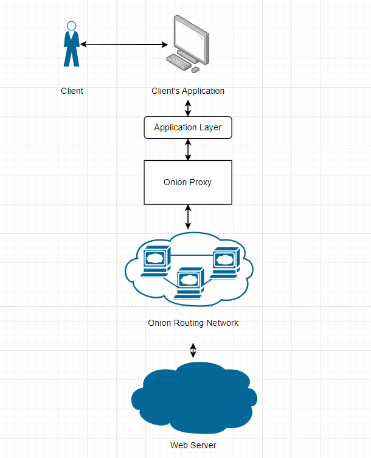
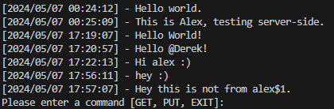

# MackYack: 
## Anonymous Messaging Service using Onion Routing 

<p style="align: center;">

  

</p>

## MackYack Protocol

### Client Functionality
---
- Message is sent to the server, where it is added to the MackYack board.
- Requests to the server are made periodically (every 3 seconds) to update the client's local view of the MackYack board.
- Anonymity is maintained by sending requests through an Onion Routing overlay network
    - Onion Routing overlay network is accessed via. an Onion Proxy. More details in "Onion Routing Protocol" section.

## Application Layer
---
MackYack is designed to be an anonymous messaging board system. We have created a Client Server model for handling operations on the board.
Client is allowed to receive messages on the board and update new messages on the board. While, the server is allowed to respond with the current state of the board and update the board when a new message is received.

<p style="align: center;">

  

</p>

There exists three commands in our Client-side application.
 - `GET` - Constructs and sends a GetRequest
 - `PUT` - Prompts the interface for a message, and sends to server
 - `EXIT` - Closes the application and destroys the circuit.

<p style="align: center;">

  

</p>

#### Application Layer Messages
There exists four types of Application layer messages that can be sent
1. PutRequest
```
Client -> Server
Sent from Client through the circuit to the Server containing a message. This message will be appended to the board.

Properties:
    - String - data
```

2. Put Response
```
Server -> Client
Response sent to client to assure that their message has been added to the board.

Properties: (none)
```

3. Get Request
```
Client -> Server
Sent from the Client through the circuit to the Server asking to receive information regarding the board at the current instant.

Properties: (none)
```

4. Get Response
```
Server -> Client
Sent from the Server through the circuit to the Client responding with all of the Messages on the Board.

Properties:
    - List<Message> - messages
```

5. Message
```
Contained within Get Response object.
Sent as a series of Messages through the Get Response object to show which messages were present on the board at the time of the request.

Properties:
    - String - data
    - String - timestamp
```


## OnionProxy
---
The `OnionProxy` (OP) class serves as a Proxy within an Onion Routing Network, facilitating communication between a client and an Entrance Onion Router. It manages the establishment of secure communication channels between nodes, message relay, and message reception. The Onion Proxy is abstracted out from the client such that it can be ran as a unique layer between any Application layer that utilizes MerrimackUtil JSON Messaging and connects to our devised Onion Network.
The Onion Proxy (OP) is utilized by MackYack clients for accessing the Onion Routing overlay network, running on the client's local computer upon the MackYack application's launch.
 - It constructs the circuit, selecting from the client's list of known routers (located in routers.json), and has the ability to deconstruct the circuit by sending a destroy cell and its associated circID to the entry Onion Router (OR).
 - The OP encrypts MackYack messages to send to the entrance onion router in "layers," akin to an onion, encrypting the message with the key established with each OR in the circuit from the farthest node to the closest.
 - Subsequently, whenever a message is received from the entrance onion router, it decrypts MackYack responses by peeling back "layers," decrypting the message with the key established with each OR in the circuit from the closest node to the farthest.
 - Additionally, the OP handles various tasks such as:
   - Determining whether a received JSON object should be processed at the Proxy Layer or the ApplicationService Layer.
   - Finding the router associated with a specified circuit ID.
   - Managing relay cells received from an Onion Router.
   - Constructing messages to be sent.
   - Sending create cells to each router in the circuit.
   - Generating create cells for each router.
   - Building the circuit from the provided router configuration.

#### Public API
### `public OnionProxy(RoutersConfig routersConfig, ClientConfig conf) throws Exception`
This constructor initializes the Onion Routing System. It requires configurations for routers and clients. Upon instantiation, it constructs the circuit, generates create cells for each OR, sends create cells to initiate circuit keys, and starts polling for new messages on the proxy.

### `public void send(String message) `
This method sends a string message to the entrance Onion Router. It establishes a socket connection and transmits the message.

### `public void pollProxy()`
Initiates the polling mechanism for new messages on the proxy.


## Onion Routing Protocol
---

`TODO:`

### Onion Routing Service
 
The OnionRouterService class serves as a handler for messages directed to an onion router, onion proxy, or web server; managing various tables and cryptographic operations. It operates within a threaded service model, handling incoming messages via the run() method. Upon receiving different types of cells, such as Relay, Create, Created, and Destroy, it executes corresponding actions like relaying messages, creating connections, updating & computing creation keys, or managing destructions. It employs cryptographic functions for encryption and decryption, including AES encryption for message security. Additionally, it facilitates communication with other nodes in the network by sending messages to specified destinations or servers. Overall, OnionRouterService provides essential functionalities for the operation of an onion router within a network architecture.

#### Symmetric Key Creation Handleing

#### Relay Handling

#### Data Handling
`Onion Peeling Messages (Request)`
 - When a message is being sent from the `Client` → `Server` it can be defined as a Onion Peeling Message in our application. This is because the onion is being peeled. The last message in the onion should be a Data message. 
 - Data Messages are destined for some server outside of the onion network (OR). 
 - To handle, the message is directed to the server outside of the OR.
 - Unfortunately, as Onion Routing paper left what we consider to be a security flaw in place. The exit onion router is able to see the plain-text information of what is contained inside a `DATA` message. This is not something we address in our service. Though we have have planned to encrypt the data child (plain-text to be sent to server) as a data secret much like we do for Relay messages. Though this time using the servers public key which is defined on startup. 

#### Destroy Handling

## Cells (Messages)
---

1. Create
```
Client -> First OR / OR -> New OR to add
Sent from Client to the first onion router to create a circuit. Also sent from OR to the new OR to be added to extend a circuit.

Properties:
    - final String - type; "CREATE"
    - int - circID
    - String - gX; Base 64-encoded first half of Diffie-Hellman KEX encrypted in the ephemeral key (see next property).
    - String - encryptedSymKey; Ephemeral key (symmetric) encrypted using the OR's public key.
    - String - srcAddr
    - int - srcPort
```

2. Created
```
Newly-added OR -> Client
Sent from the newly-added onion router to the client confirming the creation/extension of a circuit.

Properties:
    - final String - type; "CREATED"
    - String - gY; Base 64-encoded second half of Diffie-Hellman KEX.
    - String - kHash; Base 64-encoded SHA-3 256 hash: H(K || "handshake")
```

3. Destroy
```
Client -> First OR
Sent from Client to the first onion router to break down the established circuit (recursively).

Properties:
    - final String - type; "DESTROY"
    - int - circID
```

4. Data
```
Client -> Last OR in Circuit -> Server
Sent from the client to the last OR in the circuit (which is then passed to the server). Contains the data
that will be sent out to the server.

Properties:
    - final String - type; "DATA"
    - String - serverAddr; Address of the server to connect + send data to
    - int - serverPort; Port of the server to connect + send data to
    - JSONObject - child; Data to be sent over to the server (JSON marshalled; encrypted in Server's public key)
```

5. Relay
```
Client -> OR; OR -> OR
Sent by the client or an OR to the next OR in the circuit. Its function is for the receiving OR to relay the
data to the next OR in the chain without interpreting the data.

Properties:
    - final String - type; "RELAY"
    - int - circID
    - String - relaySecret; Data that is being relayed. Encrypted in onion layers to be peeled one-at-a-time
                            at the destination OR w/ the symmetric key identified by the circID
    - String - base64_IV; IV that was used to encrypt the secret.
```

5a. RelaySecret
```
Contained within Relay cell.
Contains the secret to be decrypted + relayed to the next OR.

Properties:
    - final String - type; "RELAYSECRET"
    - String - addr
    - int - port
    - JSONObject - child; The actual data (the rest is header information)
```

## Configs

### routers.json
---
Contains information on the onion routers IP / port combinations, as well as their public keys.  \
Example:
```
{
    routers: [
        {
            addr: "127.0.0.1",
            port: 5000,
            pubKey: "<node-pub-key>"
        },
        {
            addr: "127.0.0.1",
            port: 5003,
            pubKey: "<node-pub-key>"
        }
    ]
}
```

### serverConfig.json
---
Contains configuration information for the server to initialize with.  \
Example:
```
{
    port: 5010,
    privKey: "<private-key>",
    messagesPath: "./configs/messages.json"
}
```

### clientConfig.json
---
Contains configuration information for the client to initialize with.  \
Example:
```
{
    addr: "127.0.0.1",
    port: 5000,
    serverAddr: "127.0.0.1",
    serverPort: 5010,
    serverPubKey: "<server-pub-key>",
    routersPath: "example-configs/routers.json"
}
```

### messages.json
---
Contains messages and timestamps stored on the board for the server to reference at startup + write to on each Put request.  \
Example:
```
{
    messages: [
        {
            data: "Hello world.",
            timestamp: "2024/05/07 00:24:12"
        },
        {
            data: "This is Alice, saying hello from the client!",
            timestamp: "2024/05/07 00:25:09"
        }
    ]
}
```

### router_k.json
---
Contains configuration information for the router to initialize with.  \
Example:
```
{
    addr: "127.0.0.1",
    port: 5000,
    privKey: "<private-key>"
}
```

## Build
---
To build the project first make sure you have the correct libraries to build the jar. They can be found in the [lib](/lib/) folder.

First, run the `ant clean` command to remove old builds.
Then, run `ant` to build the `mackyack_client`, `mackyack_server`, and `onionrouter`.
| :zap:        Please make sure  bcprov-ext-jdk18on-172 is in the same directory as the build files when running!   |
|-----------------------------------------|


## Initiation
--- 
All commands should be ran in the root directory of the project

1. Build & Run the `Onion Routers`
   - First need to run k amount of Onion Routers (OR), where each value of k represents a unique Onion Router.
   - Run the following command for a specific Onion Router k. Replace $ with k.
   - `java -jar .\dist\onionrouter.jar --config .\configs\router-$.json`
   - You will receive a public key, on the initiation run. Update the `routers.json` public configuration accordingly.
   - To run the Onion Router, simply run the `java -jar` command again.

2. Build & Run the `Application Server`
   - Run the following command to run the MackYack application server.
   - `java -jar .\dist\mackyack_server.jar --config .\configs\server-config.json`
   - On initiation you will receive a public key, update the `client-config.json` file accordingly.
  
3. Build & Run the `Application Client and Onion Proxy`
    - 
